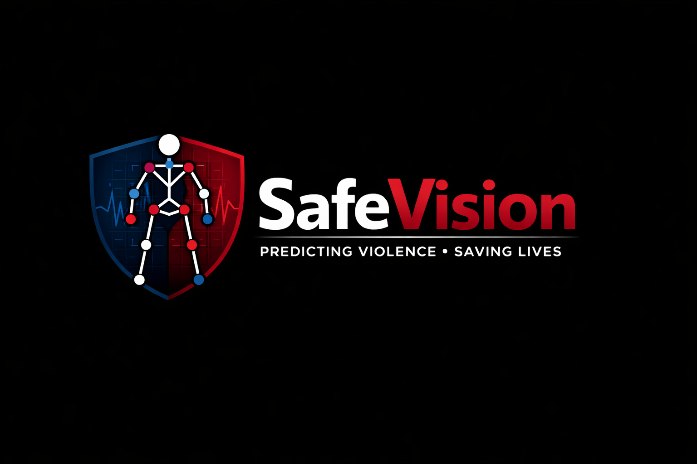

# SafeVision 🛡️



**SafeVision** is a state-of-the-art AI-powered security and surveillance ecosystem. It combines advanced deep learning (LSTM) for violence detection with a "Security-First" architecture, ensuring both proactive threat mitigation and robust data protection.

## ✨ Key Features

### 🧠 Intelligent Detection
- **Violence Anticipation**: Uses a custom LSTM model trained on RWF-2000 to detect and anticipate violent incidents in real-time.
- **Pose Estimation**: Leverages MediaPipe for high-fidelity joint tracking to analyze movement patterns.
- **Flow Analysis**: Calculates optical flow velocities and accelerations to distinguish normal activity from aggression.
- **Examples**: The `safe.mp4` and `violence.mp4` videos are examples of the model's predictions.

### 🔒 Privacy & Security
- **Privacy-by-Design**: Integrated `PrivacyEngine` for real-time face blurring and EXIF metadata stripping.
- **Visual Input Guard**: Protection against adversarial attacks, including pixel-entropy checks and high-frequency energy analysis.
- **RBAC (Role-Based Access Control)**: Hierarchical user management (Admin, Operator, Viewer) with secure token-based authentication.
- **Audit Chaining**: SHA-256 hash-chained audit logs ensure that security events are tamper-evident.

### 🚨 Smart Alarming & Evidence
- **Intelligent Alarm Engine**: Configurable rules with cooldown deduplication to prevent alert fatigue.
- **Zone Notifications**: Automated Twilio SMS alerts to zone-specific guards and SMTP email notifications.
- **Encrypted Incident Recording**: Automatic, encrypted capture of incident streams for secure evidence preservation.

### 📊 Monitoring Suite
- **Security Center**: A modern web dashboard for real-time event streaming, alarm management, and reporting.
- **Trend Analysis**: Visual data representation of security incidents and system performance.

## 🛠️ Technology Stack
- **Backend**: Python, PyTorch (LSTM), OpenCV, MediaPipe
- **Security**: Cryptography (AES-256, PBKDF2), HMAC, SSL/TLS
- **Frontend**: HTML5, Vanilla CSS3, Javascript (ES6+)
- **Storage**: JSONL (Thread-safe atomic storage)
- **Communications**: Twilio API, SMTP, Secure WebSockets (DH Key Exchange)

## 🚀 Getting Started

### Prerequisites
- Python 3.8+
- OpenCV dependencies
- Twilio Account (optional, for SMS notifications)

### Installation

1. **Clone the repository:**
   ```bash
   git clone https://github.com/your-username/safeVision.git
   cd safeVision
   ```

2. **Set up virtual environment:**
   ```bash
   python -m venv venv
   source venv/bin/activate  # Windows: venv\Scripts\activate
   ```

3. **Install dependencies:**
   ```bash
   pip install -r requirements.txt
   ```

### Running the System

1. **Initialize the Server:**
   ```bash
   cd server
   python server.py
   ```
   *Note: You will be prompted for the model decryption password on first run.*

2. **Launch the Security Center Dashboard:**
   ```bash
   cd security_center
   python app.py
   ```
   Access the dashboard at `http://localhost:5000`.

## 📁 Project Structure

- `server/`: Core backend logic, LSTM models, and security engines.
- `security_center/`: Web dashboard and API for system monitoring.
- `camera/`: Client-side camera streaming modules.
- `encryption/`: Low-level cryptographic utilities.
- `database/`: JSONL storage files and data models.
- `recordings/`: Secure storage for encrypted incident streams.

## 📜 License
This project is licensed under the MIT License - see the [LICENSE](LICENSE) file for details.

---
*Built with ❤️ by the SafeVision Team.*
